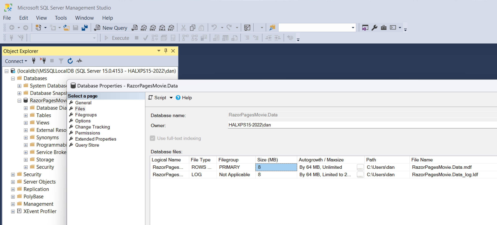

= Backend

* https://learn.microsoft.com/en-us/aspnet/core/tutorials/first-web-api?view=aspnetcore-6.0&tabs=visual-studio#install-http-repl
+
[source,powershell]
----
dotnet tool install -g Microsoft.dotnet-httprepl
----

* https://learn.microsoft.com/en-us/aspnet/core/tutorials/first-web-api?view=aspnetcore-6.0&tabs=visual-studio#test-posttodoitem-1
+
fix, use 7020 not 5001 (as per launch settings)
+
[source,powershell]
----
httprepl https://localhost:7020/api/todoitems
----
+
then
+
[source,repl]
----
post -h Content-Type=application/json -c "{"name":"walk dog","isComplete":true}"
----

== Experimenting with the repl and swagger

* re-enabled Swagger in `Program.cs`

* connect using just:
+
[source,powershell]
----
httprepl https://localhost:7020/
----
+
[source,output]
----
❯ httprepl https://localhost:7020/
(Disconnected)> connect https://localhost:7020/
Using a base address of https://localhost:7020/
Using OpenAPI description at https://localhost:7020/swagger/v1/swagger.json
For detailed tool info, see https://aka.ms/http-repl-doc

https://localhost:7020/>
----

* can cd, ls, post, get etc
+
[source,repl]
----
cd api/TodoItems
post -h Content-Type=application/json -c "{"name":"walk dog","isComplete":true}"
----
+
[source,output]
----
HTTP/1.1 201 Created
Content-Type: application/json; charset=utf-8
Date: Sat, 19 Nov 2022 10:34:03 GMT
Location: https://localhost:7020/api/TodoItems/2
Server: Kestrel
Transfer-Encoding: chunked

{
  "id": 1,
  "name": "walk dog",
  "isComplete": true
}
----

== Generate Swagger file at  built time

as per https://github.com/domaindrivendev/Swashbuckle.AspNetCore#using-the-tool-with-the-net-core-30-sdk-or-later

[source,powershell]
----
cd backend\TodoApi\TodoApi
dotnet new tool-manifest
dotnet tool install --version 6.2.3 Swashbuckle.AspNetCore.Cli      #<.>
----
<.> important to use the same version as in the app itself.

* generate with:
+
[source,powershell]
----
dotnet swagger tofile --output x.json bin\Debug\net6.0\TodoApi.dll v1
----

and adding as a PostBuild target means will be generated each time.

== Reorganised ...

renamed solution, backend proj.

== Razor MVC tutorial

as per previous commit messages...

in Package Manager console:

* create migrations
+
[source,pm]
----
PM> Add-Migration InitialCreate
----
+
results in:
+
[source,pm]
----
Build started...
Build succeeded.
Microsoft.EntityFrameworkCore.Model.Validation[30000]
No store type was specified for the decimal property 'Price' on entity type 'Movie'. This will cause values to be silently truncated if they do not fit in the default precision and scale. Explicitly specify the SQL server column type that can accommodate all the values in 'OnModelCreating' using 'HasColumnType', specify precision and scale using 'HasPrecision', or configure a value converter using 'HasConversion'.
Microsoft.EntityFrameworkCore.Infrastructure[10403]
Entity Framework Core 6.0.10 initialized 'RazorPagesMovieContext' using provider 'Microsoft.EntityFrameworkCore.SqlServer:6.0.10' with options: None
Microsoft.EntityFrameworkCore.Model.Validation[30000]
No store type was specified for the decimal property 'Price' on entity type 'Movie'. This will cause values to be silently truncated if they do not fit in the default precision and scale. Explicitly specify the SQL server column type that can accommodate all the values in 'OnModelCreating' using 'HasColumnType', specify precision and scale using 'HasPrecision', or configure a value converter using 'HasConversion'.
No store type was specified for the decimal property 'Price' on entity type 'Movie'. This will cause values to be silently truncated if they do not fit in the default precision and scale. Explicitly specify the SQL server column type that can accommodate all the values in 'OnModelCreating' using 'HasColumnType', specify precision and scale using 'HasPrecision', or configure a value converter using 'HasConversion'.
To undo this action, use Remove-Migration.
----

* apply the migrations
+
[source,pm]
----
PM> Update-Database
----
+
results in:
+
[source,pm]
----
Build started...
Build succeeded.
Microsoft.EntityFrameworkCore.Model.Validation[30000]
      No store type was specified for the decimal property 'Price' on entity type 'Movie'. This will cause values to be silently truncated if they do not fit in the default precision and scale. Explicitly specify the SQL server column type that can accommodate all the values in 'OnModelCreating' using 'HasColumnType', specify precision and scale using 'HasPrecision', or configure a value converter using 'HasConversion'.
Microsoft.EntityFrameworkCore.Infrastructure[10403]
      Entity Framework Core 6.0.10 initialized 'RazorPagesMovieContext' using provider 'Microsoft.EntityFrameworkCore.SqlServer:6.0.10' with options: None
Microsoft.EntityFrameworkCore.Model.Validation[30000]
      No store type was specified for the decimal property 'Price' on entity type 'Movie'. This will cause values to be silently truncated if they do not fit in the default precision and scale. Explicitly specify the SQL server column type that can accommodate all the values in 'OnModelCreating' using 'HasColumnType', specify precision and scale using 'HasPrecision', or configure a value converter using 'HasConversion'.
No store type was specified for the decimal property 'Price' on entity type 'Movie'. This will cause values to be silently truncated if they do not fit in the default precision and scale. Explicitly specify the SQL server column type that can accommodate all the values in 'OnModelCreating' using 'HasColumnType', specify precision and scale using 'HasPrecision', or configure a value converter using 'HasConversion'.
Microsoft.EntityFrameworkCore.Database.Command[20101]
      Executed DbCommand (181ms) [Parameters=[], CommandType='Text', CommandTimeout='60']
      CREATE DATABASE [RazorPagesMovie.Data];
Microsoft.EntityFrameworkCore.Database.Command[20101]
      Executed DbCommand (74ms) [Parameters=[], CommandType='Text', CommandTimeout='60']
      IF SERVERPROPERTY('EngineEdition') <> 5
      BEGIN
          ALTER DATABASE [RazorPagesMovie.Data] SET READ_COMMITTED_SNAPSHOT ON;
      END;
Microsoft.EntityFrameworkCore.Database.Command[20101]
      Executed DbCommand (5ms) [Parameters=[], CommandType='Text', CommandTimeout='30']
      SELECT 1
Microsoft.EntityFrameworkCore.Database.Command[20101]
      Executed DbCommand (6ms) [Parameters=[], CommandType='Text', CommandTimeout='30']
      CREATE TABLE [__EFMigrationsHistory] (
          [MigrationId] nvarchar(150) NOT NULL,
          [ProductVersion] nvarchar(32) NOT NULL,
          CONSTRAINT [PK___EFMigrationsHistory] PRIMARY KEY ([MigrationId])
      );
Microsoft.EntityFrameworkCore.Database.Command[20101]
      Executed DbCommand (0ms) [Parameters=[], CommandType='Text', CommandTimeout='30']
      SELECT 1
Microsoft.EntityFrameworkCore.Database.Command[20101]
      Executed DbCommand (10ms) [Parameters=[], CommandType='Text', CommandTimeout='30']
      SELECT OBJECT_ID(N'[__EFMigrationsHistory]');
Microsoft.EntityFrameworkCore.Database.Command[20101]
      Executed DbCommand (3ms) [Parameters=[], CommandType='Text', CommandTimeout='30']
      SELECT [MigrationId], [ProductVersion]
      FROM [__EFMigrationsHistory]
      ORDER BY [MigrationId];
Microsoft.EntityFrameworkCore.Migrations[20402]
      Applying migration '20221119115856_InitialCreate'.
Applying migration '20221119115856_InitialCreate'.
Microsoft.EntityFrameworkCore.Database.Command[20101]
      Executed DbCommand (2ms) [Parameters=[], CommandType='Text', CommandTimeout='30']
      CREATE TABLE [Movie] (
          [ID] int NOT NULL IDENTITY,
          [Title] nvarchar(max) NOT NULL,
          [ReleaseDate] datetime2 NOT NULL,
          [Genre] nvarchar(max) NOT NULL,
          [Price] decimal(18,2) NOT NULL,
          CONSTRAINT [PK_Movie] PRIMARY KEY ([ID])
      );
Microsoft.EntityFrameworkCore.Database.Command[20101]
      Executed DbCommand (1ms) [Parameters=[], CommandType='Text', CommandTimeout='30']
      INSERT INTO [__EFMigrationsHistory] ([MigrationId], [ProductVersion])
      VALUES (N'20221119115856_InitialCreate', N'6.0.10');
Done.
----

* which database did we insert into?
+
[source,json]
.appsettings.json
----
{
  "Logging": {
    "LogLevel": {
      "Default": "Information",
      "Microsoft.AspNetCore": "Warning"
    }
  },
  "AllowedHosts": "*",
  "ConnectionStrings": {
    "RazorPagesMovieContext": "Server=(localdb)\\mssqllocaldb;Database=RazorPagesMovie.Data;Trusted_Connection=True;MultipleActiveResultSets=true"
  }
}
----

* can connect to with SQL Server, disgustingly has used home directory for its files:
+

Can also access from Visual Studio 2022, `View > SQL Server Object Explorer`.

== SSDT (sqlproj, dacpac)

* Added a new "SQL Server Database Project" to the solution.

* connect to localdb, reverse engineer
** EF migrations table
** Movie table

* delete DDL for EF migrations table

* as per https://learn.microsoft.com/en-us/sql/tools/sqlpackage/sqlpackage-download?view=sql-server-ver16
+
(but making local)
+
[source,powershell]
----
cd backend\MovieDb
dotnet new tool-manifest
dotnet tool install microsoft.sqlpackage
----
+
resulting in:
+
[source,output]
----
You can invoke the tool from this directory using the following commands: 'dotnet tool run sqlpackage' or 'dotnet sqlpackage'.
Tool 'microsoft.sqlpackage' (version '161.6374.0') was successfully installed. Entry is added to the manifest file C:\github\danhaywood\tutorial-asp-net-core-api\MovieDb\.config\dotnet-tools.json.
----

* Building the project creates the .dacpac file.

* deploying
+
https://learn.microsoft.com/en-us/sql/tools/sqlpackage/sqlpackage-publish?view=sql-server-ver16
+
created a database on my HALXPS15-2022\SQLEXPRESS instance
+
[source,powershell]
----
cd MovieDb
dotnet SqlPackage /Action:Publish /SourceFile:"bin\Debug\MovieDb.dacpac" /TargetConnectionString:"Server=halxps15-2022\SQLEXPRESS;Database=dbMovie;Integrated Security=True;Encrypt=False;"
----
+
results in:
+
[source,powershell]
----
Publishing to database 'dbMovie' on server 'halxps15-2022\SQLEXPRESS'.
Initializing deployment (Start)
Initializing deployment (Complete)
Analyzing deployment plan (Start)
Analyzing deployment plan (Complete)
Updating database (Start)
Creating SqlTable [dbo].[Movie]...
Update complete.
Updating database (Complete)
Successfully published database.
Changes to connection setting default values were incorporated in a recent release.  More information is available at https://aka.ms/dacfx-connection
Time elapsed 0:00:12.62
----

* add 2 extended properties for 2 of the columns

* rebuild and redeploy
+
[source,powershell]
----
cd MovieDb
dotnet SqlPackage /Action:Publish /SourceFile:"bin\Debug\MovieDb.dacpac" /TargetConnectionString:"Server=halxps15-2022\SQLEXPRESS;Database=dbMovie;Integrated Security=True;Encrypt=False;"
----
+
results in:
+
[source,powershell]
----
Publishing to database 'dbMovie' on server 'halxps15-2022\SQLEXPRESS'.
Initializing deployment (Start)
Initializing deployment (Complete)
Analyzing deployment plan (Start)
Analyzing deployment plan (Complete)
Updating database (Start)
Creating SqlExtendedProperty [dbo].[Movie].[ReleaseDate].[gdpr_brand]...
Creating SqlExtendedProperty [dbo].[Movie].[ReleaseDate].[gdpr_category]...
Creating SqlExtendedProperty [dbo].[Movie].[Title].[gdpr_brand]...
Creating SqlExtendedProperty [dbo].[Movie].[Title].[gdpr_category]...
Update complete.
Updating database (Complete)
Successfully published database.
Changes to connection setting default values were incorporated in a recent release.  More information is available at https://aka.ms/dacfx-connection
Time elapsed 0:00:11.83
----

== Evolve (as a library)

for the RazorPagesMovie

* add nuget package
+
[source,powershell]
----
cd RazorPagesMovie
dotnet add package Evolve --version 3.1.0-alpha7
----

* reverse engineers scripts

== DAPR

Need to disable https in startup, else will get SSL connection errors.
(The alternative is running sentry manually and priming )

* Start Docker Desktop

* (Re)start dapr:
+
[source,powershell]
----
dapr uninstall
dapr init
----

* added dapr sidekick nuget library, and add into `Program.cs`

* also *DISABLE* https in `Program.cs`
+
because mTLS does not run in local mode

* reconfigure HttpClient using DAPR
+
https://learn.microsoft.com/en-us/dotnet/architecture/dapr-for-net-developers/service-invocation

** this works and is recommended:
+
[source,c#]
----
var httpClient = daprSidecarHttpClientFactory.CreateInvokeHttpClient("moviebackend");
----
+
where `daprSidecarHttpClientFactory` is an injected instance of `IDaprSidecarHttpClientFactory`

** but this also seems to work:
+
[source,c#]
----
var httpClient = new HttpClient();
httpClient.DefaultRequestHeaders.Add("dapr-app-id", "moviebackend");
httpClient.BaseAddress = new Uri("http://localhost:3500");
----
+
what's interesting here, don't quite understand, is that when tested (later) that port `3500` works irrespective of whether `moviebackend` is started before `moviefrontend`, OR, the other way around (reversing the ports that the two apps get)

* start both apps
+
both are starting their own `daprd` correctly.

* inspect
+
[source,powershell]
----
dapr list
----
+
shows
+
[source,output]
----
APP ID         HTTP PORT  GRPC PORT  APP PORT  COMMAND  AGE  CREATED              DAPRD PID  CLI PID
moviebackend   3500       50001      5095               58m  2022-11-19 17:21.23  53844      0
moviefrontend  3501       50002      5085               5s   2022-11-19 18:19.43  46392      0
----

* tracing captures interactions, at http://localhost:9411/zipkin/

== Evolve incremental?

* Added `Actor.sql`

* rebuilt

=== First idea
* install Evolve dotnet tool
+
[source,powershell]
----
dotnet tool install --global Evolve.Tool
----

* preview from assembly
+
[source,powershell]
----
evolve migrate sqlserver -c "Server=(localdb)\\mssqllocaldb;Database=RazorPagesMovieUsingEvolve.Data;Trusted_Connection=True;MultipleActiveResultSets=true" --embedded-resource-assembly MovieBackend/bin/Debug/net6.0/MovieBackend.dll --transaction-mode RollbackAll
----
+
Using SQL Profiler, this does capture all the commands required.
So in theory could wrap with some Powershell to start profiler, run the above, stop profiler and then export the trace.
+
see `evolve-trace-definition.sql` for the SQL that could be called from a Powershell script.

=== Second idea

PROBABLY EASIER:

* write a custom tool that uses Evolve SDK, but enable SqlClientListener to capture events
+
https://learn.microsoft.com/en-us/sql/connect/ado-net/enable-eventsource-tracing?view=sql-server-ver16

== GraphQL Server (MovieBackend)

https://chillicream.com/blog/2020/03/18/entity-framework

updated from v10 to v12

== GraphQL Client (MovieFrontend)

https://chillicream.com/docs/strawberryshake/get-started

working in the `MovieFrontend` folder:

[source,powershell]
----
dotnet new tool-manifest
----

[source,powershell]
----
dotnet tool install StrawberryShake.Tools --local
----

[source,powershell]
----
dotnet graphql init https://localhost:7092/graphql/ -n MovieFrontend -p ./Graphql
----

adds a simple query:

[source,graphql]
.Graphql/Queries.graphql
----
query movies {
  movies {
    id
    title
    releaseDate
    genre
    price
  }
}
----

