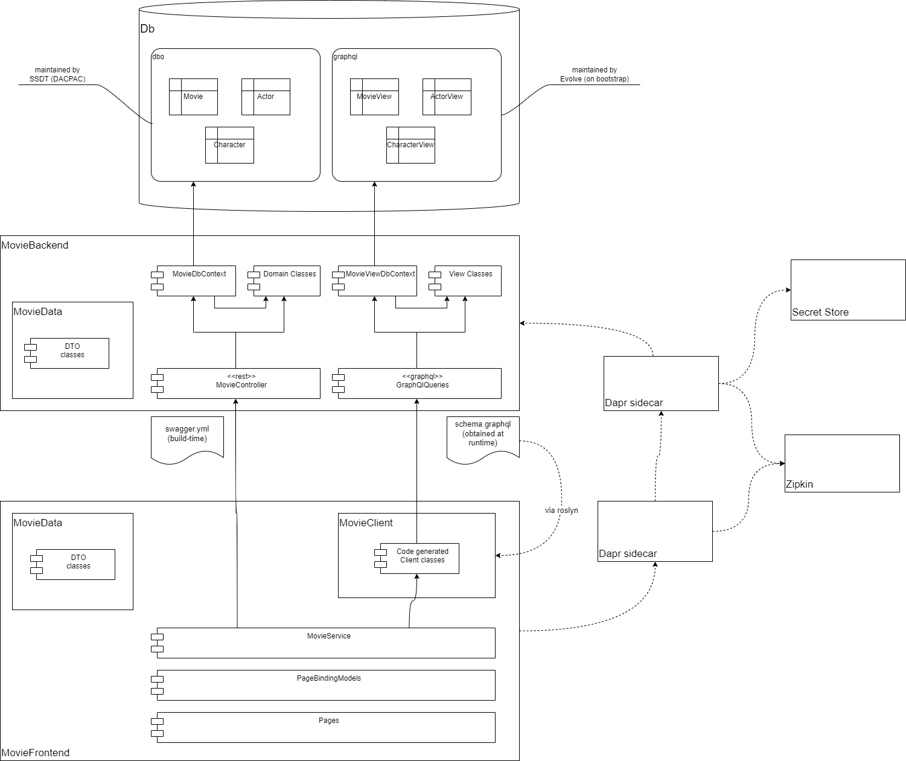
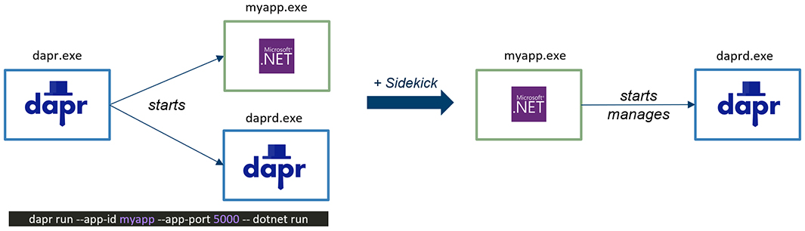
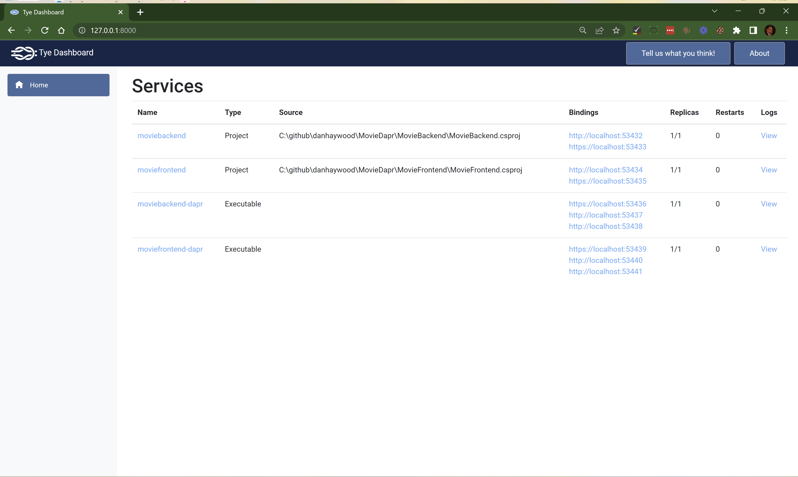

= Movie app

Demonstrating use of:

* SSDT (DACPAC) for database definition
* embedded Evolve to maintain backend-specific views (representing the DTO mapping)
* sidekick for dapr dev environment
* graphql for querying (using views)
** support sorting, filtering
** support paging (commented out for the moment)
** including /graphql playground
** codegen client-side DTOs using Strawberry Shake
* rest for updates 
* swagger via Swashbuckle
** also generate swagger.yml file
* dapr for service invocations
* dapr for distribute tracing (via zipkin)
** use of ActivitySource for custom spans
** include instrumenting SqlClient
* automatically seeds data in DB (if none present)
* dapr for secrets lookup
* GraphQL frontend to own library
* GraphQl frontend participates in distributed tracing
* dapr sidekick dependent on environment (if `DAPR_xxx` env vars present, then skip).
* using tye to emulate an orchestrator
* building Docker images

== Design

== prerequisites:

* install Docker Desktop

* install Dapr
+
https://docs.dapr.io/getting-started/install-dapr-cli/
+
[source,powershell]
----
iwr -useb https://raw.githubusercontent.com/dapr/cli/master/install/install.ps1 | iex
----

* configure local secrets component
+
[source,yaml]
.~/dapr/components/movie-secret-store.yml
----
apiVersion: dapr.io/v1alpha1
kind: Component
metadata:
  name: movie-secret-store
  namespace: default
spec:
  type: secretstores.local.file
  version: v1
  metadata:
    - name: secretsFile
      value: movie-secrets.json
    - name: nestedSeparator
      value: ":"
----
+
and
+
[source,json]
.~/dapr/bin/movie-secrets.json
----
{
    "ConnectionString": "Server=halxps15-2022\\SQLEXPRESS;Database=dbMovie;Integrated Security=True;Encrypt=False;Trusted_Connection=True;MultipleActiveResultSets=true"
 }
----
+
NOTE: dapr sidekick runs daprd in its home directory, `~/.dapr/bin`.
Haven't figured out how to relocate yet.

== Build

* swagger.yml created
+
`MovieBackend/bin/Debug/net6.0/swagger.yml`

* DACPAC created
+
`Db/bin/Debug/Db.dacpac`

== Deploy database

* restore tool
+
[source,powershell]
----
cd Db
dotnet tool restore
----

* deploy with sql package
+
[source,powershell]
----
dotnet SqlPackage /Action:Publish /SourceFile:"bin\Debug\Db.dacpac" /TargetConnectionString:"Server=halxps15-2022\SQLEXPRESS;Database=dbMovie;Integrated Security=True;Encrypt=False;"
----

* confirm DB ok
+
tables (but no views)

== Run dapr

* run dapr
+
[source,powershell]
----
dapr init
----

// * inspect dashboard
// +
// [source,powershell]
// ----
// dapr dashboard
// ----
// +
// http://localhost:8080

== Run backend

* Run the backend (on port 7092)

* Inspect the database
+
Views should have been created by Evolve (`graphql` schema).

* sidekick should have started `daprd.exe`:
+
[source,powershell]
----
dapr list
----
// +
// NB: will _not_ appear on the dashboard though :-(
+

* inspect Swagger backend, https://localhost:7092/swagger
+
try out "Get movies"

* inspect Graphql playground, navigate to http://localhost:7092/graphql
+
[source,graphql]
----
query {
  movies {
    id
    title
    releaseDate
    genre
    price
  }
}
----

* inspect Zipkin, navigate to http://localhost:9411/zipkin
+
compare the SQL in both cases

== Run frontend

* run the frontend also (on port 7082)

* Should be able to list, edit
+
* inspect Zipkin, navigate to http://localhost:9411/zipkin

* Perform an edit
+
* inspect Zipkin

* Perform a delete (which has a bug in it)
+
* inspect Zipkin, can see reason why movie doesn't delete

== tye

Install link:https://github.com/dotnet/tye[tye] (see link:https://github.com/dotnet/tye/blob/main/docs/getting_started.md[here]])

* run:
+
[source,powershell]
----
tye run
----
+
inspect dashboard at http://localhost:8000[]
+

* use `https://` endpoints to access
** for backend, `/swagger` and `/graphql`
** for frontend, `/movies`

* zipkin still available at http://localhost:9411/zipkin/

//* change some HTML in frontend
//+
//should restart

* `ctrl-C` to stop everything

* debugging
+
set a breakpoint at first line of `Program.cs` in `MovieBackend`
+
[source,powershell]
----
tye run --debug moviebackend
----
+
and then attach using Visual Studio 2022

== Docker

in root folder:

* build backend
+
[source,powershell]
----
docker build -f MovieBackend/Dockerfile -t moviebackend:latest .
----

* build frontend
+
[source,powershell]
----
docker build -f MovieFrontend/Dockerfile -t moviefrontend:latest .
----

* confirm built:
+
[source,powershell]
----
docker image ls
----

// * confirm built:
// +
// [source,powershell]
// ----
// docker run -p 7092:7092 moviebackend:latest
// docker run -p 7082:7082 moviefrontend:latest
// ----

== TODO

* `tye build` fails to create images fails, need to figure out why.
* tye watch

* run Docker images in k8s (deploy via tye)

* ACA deploy

* better error handling on DELETE (FK violation not shown, but traceable via zipkin).

* use `builder.Services.AddPooledDbContextFactory<MovieDbContext>(options => )`
+
for performance

